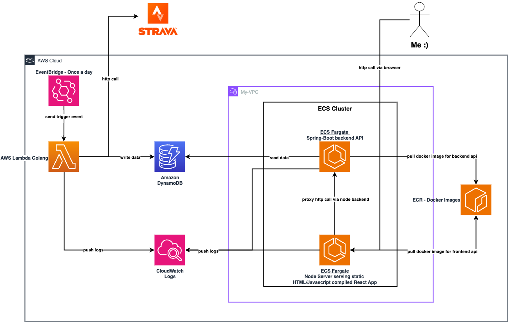

# Running Data Tracker

This README provides technical details about the Running Data Tracker project. It is a personal project designed to track and display my yearly running progress using AWS infrastructure.

## Infrastructure Setup

The project is deployed on AWS using Terraform for Infrastructure as Code. It utilizes a locally stored remote state since the project is not productionized and developed by a single user.

## Components

### Golang Lambda Function

- **Purpose**: Retrieve running data from Strava API.
- **Authentication**: Executes an OAuth flow to obtain an access token.
- **Data Retrieval**:
  - Fetches user ID using the access token.
  - Retrieves running data, extracts distance ran, and appends the date as epoch time.
- **Storage**: Stores data in DynamoDB with epoch time as the key and distance ran as the value.
- **Execution**: Runs once every 24 hours to accumulate daily running data.

### Spring Boot REST API

- **Purpose**: Expose running data stored in DynamoDB.
- **Deployment**:
  - Compiled into a Docker image.
  - Deployed to an ECR repository.
  - Runs on ECS Fargate.
- **Authentication**: Accesses DynamoDB using a role with read policies defined in Terraform.

### React Frontend

- **Purpose**: Display running data graphically.
- **Server**: Served via a Node.js server.
- **Security**: Uses a proxy to the Spring Boot REST API to improve security and bypass CORS.
- **Deployment**:
  - Bundled into a Docker image.
  - Deployed to an ECR repository.
  - Runs on ECS Fargate.

### AWS Service Discovery

- **Purpose**: Establish hostnames for frontend and backend communication.

## Future Improvements

- **Custom range of date**: Improve front end to be able to supply a custom date range for the data to be displayed. Implement methods to display custom date range data in the back end.
- **More data**: Change the front end to show different data that it would get from the back end such as PBs for example. This would need changes to all components.
- **Implement proper oAuth Flow**: Right now the oAuth flow is simplified and not 100% to spec. Implement a proper oAuth flow or leverage the Strava clients/SDKs.
- **Application Load Balancer**: Instead of using public ip addressed to communicate into my front end an Application Load Balancer could be implemented with proper domain names set up.
